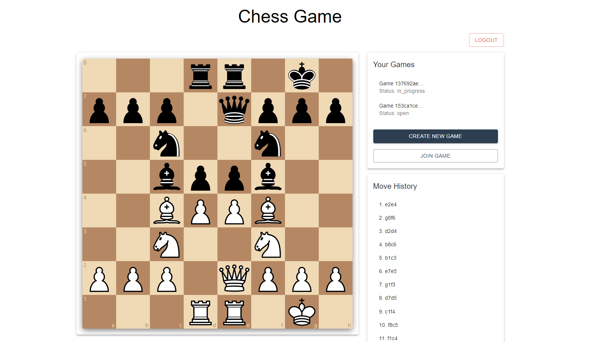

# Full Stack Chess Game

A full-stack web application for playing chess online. This project offers a smooth and interactive experience for users, allowing them to authenticate, create games, join existing games, and play chess in real-time against other players. Built with a Python-based Flask backend and a React frontend, it leverages real-time updates and uses the chess library for move validation and game management.



## Table of Contents
1. [Features](#features)
2. [Technologies Used](#technologies-used)
3. [Installation](#installation)
   - [Backend Setup](#backend-setup)
   - [Frontend Setup](#frontend-setup)
4. [How to Play](#how-to-play)
5. [API Endpoints](#api-endpoints)
6. [Contributing](#contributing)
7. [License](#license)

## Features

- User authentication (register, login, logout)
- Create new chess games
- Join existing games
- Play chess with other users
- Real-time game updates

## Technologies Used

### Backend:
- Python 3.x
- Flask
- SQLAlchemy
- Flask-JWT-Extended
- Flask-Migrate
- python-chess

### Frontend:
- React
- TypeScript
- Material-UI
- Axios
- react-chessboard

## Installation

### Backend Setup

1. Clone the repository:
   ```
   git clone <your-repository-url>
   cd chess-game
   ```

2. Create a virtual environment:
   ```
   python -m venv venv
   source venv/bin/activate  # On Windows, use `venv\Scripts\activate`
   ```

3. Install dependencies:
   ```
   pip install -r requirements.txt
   ```

4. Set up the database:
   ```
   flask db upgrade
   ```

5. Run the Flask server:
   ```
   python app.py
   ```

### Frontend Setup

1. Navigate to the frontend directory:
   ```
   cd frontend
   ```

2. Install dependencies:
   ```
   npm install
   ```

3. Start the React development server:
   ```
   npm start
   ```

## How to Play

1. Register for an account or log in if you already have one.
2. Create a new game or join an existing game from the list of open games.
3. When it's your turn, click on the piece you want to move, then click on the square you want to move it to.
4. The game will automatically update after each move.
5. The game ends when one player checkmates the other or when a draw occurs.

## API Endpoints

| Endpoint | Method | Description |
|----------|--------|-------------|
| `/register` | POST | Register a new user |
| `/login` | POST | Log in a user |
| `/new_game` | POST | Create a new game |
| `/join_game/<game_id>` | POST | Join an existing game |
| `/get_games` | GET | Get all games for the current user |
| `/get_board/<game_id>` | GET | Get the current state of a game |
| `/make_move/<game_id>` | POST | Make a move in a game |

## Contributing

Contributions are welcome! Please feel free to submit a Pull Request.
